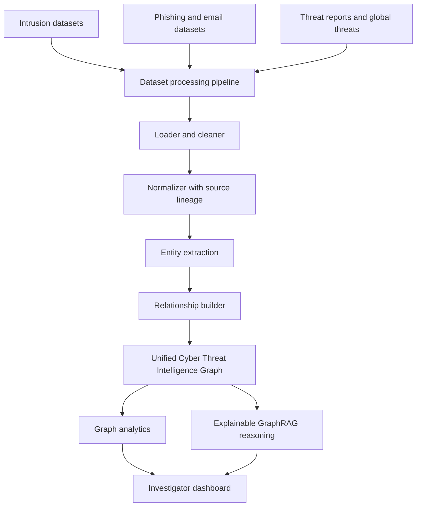

# Cyber Intelligence Knowledge Graph Integration

## Architecture

The existing NCRB public graph and authorized investigation graph remain intact. The new third layer is stored by the existing Neo4j-compatible graph database as `UNIFIED_CYBER_THREAT_INTELLIGENCE`.

## Dataset Integration Report

Supported raw dataset folders:

- `backend/datasets/raw/intrusion/`
- `backend/datasets/raw/network/`
- `backend/datasets/raw/phishing/`
- `backend/datasets/raw/email/`
- `backend/datasets/raw/threat_reports/`
- `backend/datasets/raw/global_threats/`

Accepted formats are CSV, JSON, JSONL, and text. Each record receives source-file and source-record lineage. Normalized records are written to `backend/datasets/processed/`.

The repository currently contains NCRB CSV fixtures but no supplied files for the six new cybersecurity folders. Drop the provided files into the corresponding folder, then call `POST /api/cyber/datasets/ingest-all`.

## Unified Database Schema

### CyberEntity

- `id`: deterministic stable identifier
- `name`: indicator or entity value
- `type`: `IPAddress`, `Domain`, `URL`, `EmailAddress`, `Malware`, `ThreatActor`, `AttackType`, `Vulnerability`, `Hash`, `NetworkDevice`, `Organization`, `Location`, or `Event`
- `risk_score`: baseline score from 0 to 100
- `confidence`: extraction/resolution confidence
- `source_dataset`: normalized dataset folder
- `source_record_id`: source file and row identifier
- `attributes`: original context and normalized fields

### CyberRelationship

- `id`: deterministic relationship identifier
- `source_id`, `target_id`: graph endpoints
- `type`: `CONNECTED_TO`, `COMMUNICATED_WITH`, `TARGETED`, `HOSTED`, `USED`, `ATTACKED`, `DISTRIBUTED`, `ASSOCIATED_WITH`, `REGISTERED_TO`, `OBSERVED_IN`, `RELATED_TO`, `SENT_FROM`, or `ATTACKED_BY`
- `confidence`
- `source_dataset`, `source_record_id`
- `attributes`

## Models Added

- Graph-native risk scoring based on seed risk, degree, malicious-link count, and source confidence
- Degree-baseline anomaly detection for unusual infrastructure growth and high-connectivity indicators
- Common-neighbor link prediction with confidence and evidence reasons
- Explainable multi-hop reasoning with observation, source evidence, graph path, confidence, and analyst verification requirement

These are deterministic, explainable baselines. No standalone machine-learning classifier is trained, and existing graph algorithms are not replaced. Optional spaCy/Transformers integration can be added later behind the same extractor interface.

## API Endpoints

- `GET /api/cyber/datasets`
- `POST /api/cyber/datasets/{dataset}/upload`
- `POST /api/cyber/datasets/{dataset}/ingest`
- `POST /api/cyber/datasets/ingest-all`
- `GET /api/cyber/graph`
- `GET /api/cyber/overview`
- `GET /api/cyber/risk/{entity_id}`
- `GET /api/cyber/anomalies`
- `GET /api/cyber/link-predictions`
- `POST /api/cyber/reason`

## Demo Workflow

1. Upload a phishing CSV to `backend/datasets/raw/phishing/` or use the upload endpoint.
2. Run `POST /api/cyber/datasets/phishing/ingest`.
3. Open the dashboard and review Cyber Threat Intelligence Graph KPIs.
4. Open the Knowledge Graph and select cybersecurity entity filters.
5. Query `GET /api/cyber/risk/{entity_id}` for explainable scoring.
6. Query `GET /api/cyber/link-predictions` for hidden-association candidates.
7. Ask `POST /api/cyber/reason` with questions such as `Why is secure.example.com suspicious?`.
8. Require analyst verification before operational or judicial action.

## Completion

- Dataset folder structure: complete
- Loader/cleaner/normalizer/extractor/relationship builder: complete
- Unified graph storage and query API: complete
- Graph-native risk/anomaly/link prediction baselines: complete
- Explainable cyber reasoning endpoint: complete
- Dashboard overview KPIs and graph filter vocabulary: complete
- Production Neo4j/PostgreSQL/vector database adapters: prepared by schema, not connected in this local prototype
- Supplied dataset import: pending until source files are placed in `backend/datasets/raw/`
