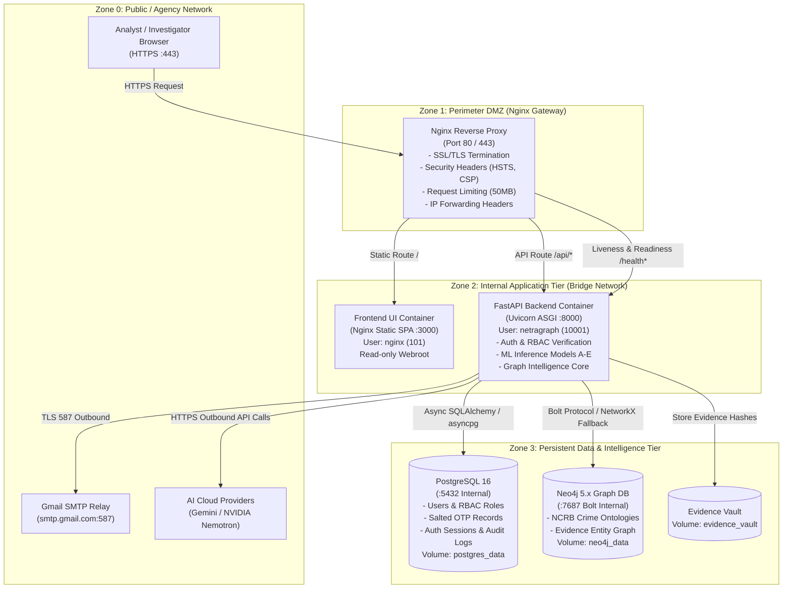

# NetraGraph — Deployment Architecture & Trust Boundaries

This document defines the containerized deployment topology, network boundaries, and defense-in-depth isolation layers of the NetraGraph intelligence system.

---

## 1. High-Level Architecture Topology



---

## 2. Network Segmentation & Trust Boundaries

| Trust Zone | Components | Permitted Inbound Traffic | Outbound Permissions |
|---|---|---|---|
| **Zone 0: Public / Client Network** | User Workstations, External Gateways | None | Port 443 (HTTPS) to Nginx |
| **Zone 1: Perimeter DMZ** | Nginx Reverse Proxy Container | Public Ports 80, 443 | Internal port 3000 (Frontend), 8000 (Backend) |
| **Zone 2: Application Tier** | Frontend Container, Backend Container | Port 3000 from Nginx, Port 8000 from Nginx | Internal ports 5432 (Postgres), 7687 (Neo4j), Outbound 587 (SMTP), 443 (AI APIs) |
| **Zone 3: Persistent Data Tier** | PostgreSQL 16, Neo4j 5.x, Named Volumes | Port 5432 from Backend, Port 7687 from Backend | None (Isolated from internet) |

---

## 3. Container Security & Defense-in-Depth

### A. Non-Root Execution
- **Backend**: Executes strictly under unprivileged user `netragraph` (`UID 10001`, `GID 10001`). No sudo or root capabilities inside container.
- **Frontend**: Executes under standard unprivileged `nginx` (`UID 101`).

### B. Filesystem Security
- Application code mounted as read-only where practical.
- Writable paths restricted strictly to dedicated ephemeral/storage directories:
  - `/app/evidence_vault` (Evidence storage)
  - `/app/logs` (Diagnostic logs)
  - `/var/cache/nginx` & `/var/run/nginx.pid` (Nginx buffers)

### C. Secret Separation
- Zero `.env` files copied into Docker image layers (`.dockerignore` enforces complete exclusion).
- All database passwords, JWT signing keys, and SMTP App Passwords injected dynamically via runtime environment variables.

---

## 4. Ingress Routing Specification

```text
https://netragraph.agency.gov/
│
├── /                           ──► Frontend Container (:3000) [Static React SPA]
├── /assets/*                   ──► Frontend Container (:3000) [Cached Static JS/CSS]
│
├── /api/auth/*                 ──► Backend Container (:8000) [OTP & JWT Service]
├── /api/cyber/*                ──► Backend Container (:8000) [Cyber Threat Intelligence]
├── /api/graph/*                ──► Backend Container (:8000) [Knowledge Graph Engine]
├── /api/analytics/*            ──► Backend Container (:8000) [Threat Metrics]
├── /api/ml/*                   ──► Backend Container (:8000) [Production Models A-E]
│
├── /health                     ──► Backend Container (:8000) [Liveness Probe]
├── /health/db                  ──► Backend Container (:8000) [PostgreSQL Probe]
└── /health/ready               ──► Backend Container (:8000) [Cluster Readiness Probe]
```

---

## 5. Observability & Health Monitoring Architecture

- **Liveness Probe (`GET /health`)**: Checks if the FastAPI application event loop is responding. Returns HTTP 200 `{"status": "HEALTHY"}`.
- **Readiness Probe (`GET /health/ready`)**: Validates that database connection pooling is active and the knowledge graph engine is initialized. Returns HTTP 200 `{"status": "READY"}` or HTTP 503 `{"status": "NOT_READY"}`.
- **Logging Pipeline**: Structured JSON and timestamped RFC 5424 logs sent to `stdout`/`stderr` for collection by Docker logging drivers, Syslog, or OpenTelemetry agents with zero secret leakage.
