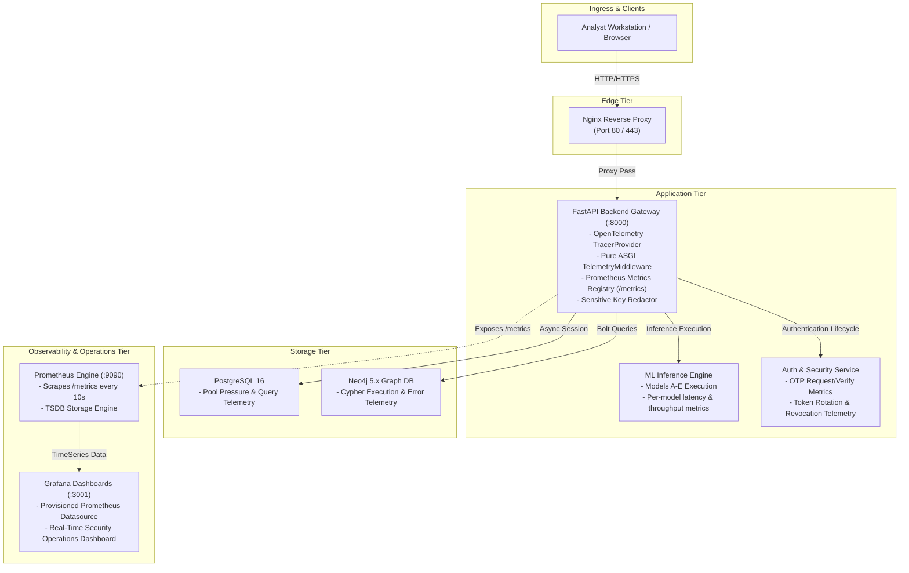

# NetraGraph — Production Telemetry & Observability Architecture

This guide details the OpenTelemetry distributed tracing, Prometheus metrics collection, Grafana operational dashboards, and privacy/secret scrubbing controls implemented in NetraGraph.

---

## 1. Observability Architecture Overview

---

## 2. OpenTelemetry Distributed Tracing

### A. Trace Provider & Span Lifecycle
- **Implementation**: Built upon official `opentelemetry-api` and `opentelemetry-sdk` with custom sanitized context managers (`trace_span`) and decorators (`@traced`).
- **Resource Attributes**:
  - `service.name`: `netragraph-backend`
  - `service.version`: `2.5.0`
  - `deployment.environment`: `production`

### B. Trace Spans Captured
1. `HTTP {METHOD} {PATH}` — Top-level HTTP request lifecycle, recording status code, duration, and client scheme.
2. `ml.inference.{MODEL_NAME}` — Model inference execution across Models A–E (`intrusion`, `network-intrusion`, `phishing-url`, `webpage-phishing`, `phishing-email`).
3. `auth.otp_request` & `auth.otp_verify` — Authentication lifecycle events.
4. `database.query` & `neo4j.query` — Data persistence and knowledge graph query tracing.

### C. Zero-Secret & PII Scrubbing
All span attributes are recursively sanitized against the forbidden security dictionary:
`password`, `token`, `access_token`, `refresh_token`, `jwt`, `secret`, `otp`, `salt`, `otp_hash`, `authorization`, `cookie`, `database_url`, `neo4j_password`.
Values matching sensitive patterns are replaced with `[REDACTED]`.

---

## 3. Prometheus Metrics Catalog

All Prometheus metrics adhere to strict **low-cardinality** standards to prevent TSDB memory bloat. Dynamic IDs (e.g., `/api/cases/CASE-12345`) are automatically normalized to template paths (`/api/cases/{id}`).

| Metric Name | Type | Labels | Description |
|---|---|---|---|
| `netragraph_http_requests_total` | Counter | `method`, `endpoint`, `status_code` | Total HTTP requests processed by API gateway |
| `netragraph_http_request_duration_seconds` | Histogram | `method`, `endpoint` | Request processing latency (buckets: 5ms to 10s) |
| `netragraph_http_errors_total` | Counter | `method`, `endpoint`, `error_type` | Total 4xx and 5xx HTTP error responses |
| `netragraph_db_pool_utilization` | Gauge | `database` | PostgreSQL connection pool saturation (0-100%) |
| `netragraph_db_queries_total` | Counter | `operation`, `status` | PostgreSQL operations executed |
| `netragraph_db_query_duration_seconds` | Histogram | `operation` | Database query execution latency |
| `netragraph_neo4j_queries_total` | Counter | `operation`, `status` | Neo4j Cypher operations executed |
| `netragraph_neo4j_query_duration_seconds` | Histogram | `operation` | Neo4j execution latency |
| `netragraph_neo4j_errors_total` | Counter | `error_type` | Neo4j database errors |
| `netragraph_ml_inference_total` | Counter | `model_name`, `status` | Forensic predictions executed across Models A–E |
| `netragraph_ml_inference_duration_seconds` | Histogram | `model_name` | ML inference latency (buckets: 1ms to 1s) |
| `netragraph_ml_inference_errors_total` | Counter | `model_name`, `error_type` | ML model validation or execution errors |
| `netragraph_auth_events_total` | Counter | `event_type`, `status` | Authentication events (otp_request, verify, login, logout) |
| `netragraph_websocket_connections_active` | Gauge | *None* | Number of currently active WebSocket connections |

---

## 4. Grafana Dashboards & Provisioning

The Grafana instance is pre-configured with declarative provisioning:
- **Datasource**: Automatic connection to Prometheus (`http://prometheus:9090`).
- **Dashboard File**: `docker/grafana/dashboards/netragraph-telemetry.json`.
- **Dashboard Sections**:
  1. **API Gateway & Traffic Overview**: Request throughput (req/s), P95 Latency, Status code distribution.
  2. **Database & Knowledge Graph**: PostgreSQL pool pressure gauge, Neo4j operations/sec, average Cypher latency.
  3. **ML Models A–E Real-Time Inference**: Throughput per model, P95 computation latency.
  4. **Authentication & Security Operations**: OTP request/verify rate, lockout/rate-limit alerts.

---

## 5. Security & Privacy Guarantees

- [x] **No PII in Labels**: Metric labels strictly exclude email addresses, usernames, client IPs, case IDs, and tokens.
- [x] **No Credentials in Traces**: Attribute redaction filter active across all spans.
- [x] **Non-Root Execution**: Prometheus (`nobody:65534`) and Grafana (`grafana:472`) run as unprivileged users.
- [x] **Network Isolation**: Prometheus scrapes over internal bridge `netragraph-net` without exposing internal database ports.
- [x] **Graceful Fallback**: If Prometheus or Grafana are stopped, backend API performance is unaffected.
