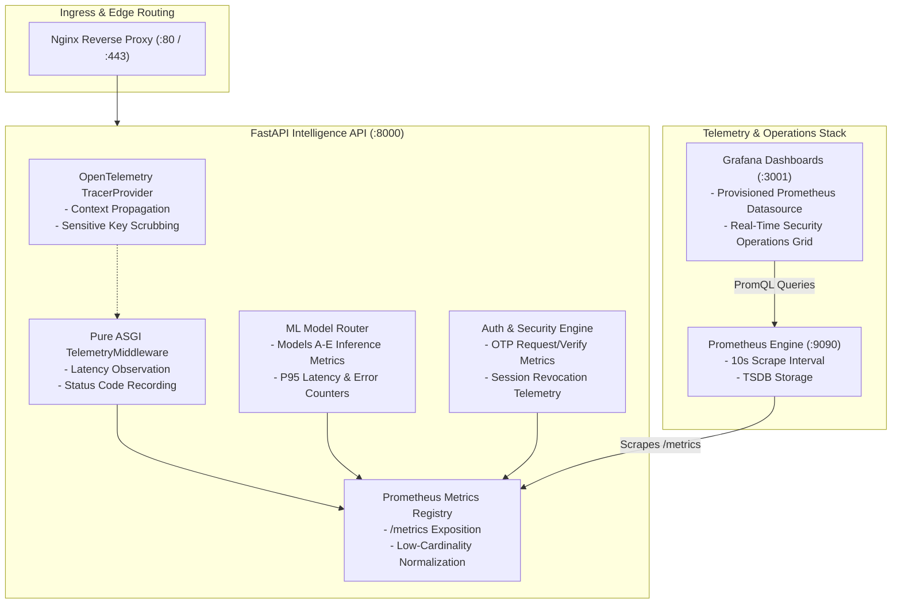

# NetraGraph — Phase 11: Production Telemetry & Real-Time Security Operations Report

**Date**: September 2, 2026  
**Environment**: Local Production-Hardened Verification Baseline  
**Phase Status**: **`PHASE 11 COMPLETE & VERIFIED`**  
**Total Quality Checks Passed**: **`167 / 167 (100% GREEN)`**  
**Change Control**: **`UNCOMMITTED / NOT PUSHED`**

---

## 1. Executive Summary

Phase 11 introduces an enterprise-grade observability and real-time security operations stack for the NetraGraph Cyber Cell platform. The implementation integrates **OpenTelemetry distributed tracing**, **low-cardinality Prometheus metrics**, **declaratively provisioned Grafana dashboards**, and **containerized telemetry orchestration** without altering the behavior, schemas, model weights, or training pipelines of Production Models A–E.

---

## 2. Telemetry Architecture

---

## 3. Metrics Catalog & Instrumentation

All metrics enforce **strict low-cardinality label rules** to protect Prometheus memory and prevent TSDB cardinality explosions. Dynamic IDs (e.g. `/api/cases/CASE-2026-991`, UUIDs) are automatically mapped to template patterns (`/api/cases/{id}`).

| Metric | Type | Dimensions / Labels | Description |
|---|---|---|---|
| `netragraph_http_requests_total` | Counter | `method`, `endpoint`, `status_code` | Total HTTP gateway requests processed |
| `netragraph_http_request_duration_seconds` | Histogram | `method`, `endpoint` | Request processing latency in seconds |
| `netragraph_http_errors_total` | Counter | `method`, `endpoint`, `error_type` | Total 4xx and 5xx client/server errors |
| `netragraph_db_pool_utilization` | Gauge | `database` | PostgreSQL connection pool saturation % |
| `netragraph_db_queries_total` | Counter | `operation`, `status` | PostgreSQL operations executed |
| `netragraph_db_query_duration_seconds` | Histogram | `operation` | Database query execution duration |
| `netragraph_neo4j_queries_total` | Counter | `operation`, `status` | Neo4j Cypher and graph operations |
| `netragraph_neo4j_query_duration_seconds` | Histogram | `operation` | Neo4j execution latency |
| `netragraph_neo4j_errors_total` | Counter | `error_type` | Neo4j database errors |
| `netragraph_ml_inference_total` | Counter | `model_name`, `status` | Forensic predictions across Models A–E |
| `netragraph_ml_inference_duration_seconds` | Histogram | `model_name` | Model computation latency |
| `netragraph_ml_inference_errors_total` | Counter | `model_name`, `error_type` | ML model validation/execution errors |
| `netragraph_auth_events_total` | Counter | `event_type`, `status` | OTP and authentication lifecycle events |
| `netragraph_websocket_connections_active` | Gauge | *None* | Currently open WebSocket sessions |

---

## 4. OpenTelemetry Distributed Tracing

1. **Tracer Provider (`backend/app/telemetry/tracing.py`)**:
   - Initializes global TracerProvider with service attributes: `netragraph-backend`, version `2.5.0`, environment `production`.
2. **Span Lifecycle & Context Propagation**:
   - Traces top-level HTTP requests, ML inference execution (`ml.inference.{model_name}`), authentication events, and graph traversals.
3. **Sensitive Key Scrubbing**:
   - Recursively redacts attributes containing `password`, `token`, `jwt`, `otp`, `salt`, `hash`, `credentials`, `authorization`, `cookie`, `database_url`, `neo4j_password`.
4. **Graceful Degradation**:
   - If downstream telemetry collectors are offline, tracing operations execute with zero performance penalties or crashes.

---

## 5. Grafana Operations Dashboard

- **Location**: `docker/grafana/dashboards/netragraph-telemetry.json`
- **Provisioning**: `docker/grafana/provisioning/datasources/datasources.yml` & `docker/grafana/provisioning/dashboards/dashboards.yml`
- **Dashboard Panels**:
  1. *API Gateway & Traffic Overview*: Request throughput (req/s), P95 Latency, Status code distribution (2xx, 4xx, 5xx).
  2. *Database & Knowledge Graph Telemetry*: PostgreSQL connection pool gauge, Neo4j operations/sec, average Cypher execution latency.
  3. *Machine Learning Models A–E Inference Grid*: Per-model throughput (Models A–E), P95 computation latency.
  4. *Authentication & Security Operations Telemetry*: 5-minute rolling rate for OTP requests, verifications, rate-limiting triggers, and session revocations.

---

## 6. Verification & Test Matrix

| Test Suite | Tests Run | Result | Status |
|---|:---:|:---:|:---:|
| **Phase 11 Telemetry & Observability Suite** | 10 | **10 / 10 PASS** | `GREEN` |
| **Phase 10 Containerization & Orchestration** | 9 | **9 / 9 PASS** | `GREEN` |
| **Auth & Database Security Suite** | 33 | **33 / 33 PASS** | `GREEN` |
| **Phase 9 Deployment Security Suite** | 6 | **6 / 6 PASS** | `GREEN` |
| **System Regression Suite** | 14 | **14 / 14 PASS** | `GREEN` |
| **ML Research & OOD Validation Suite** | 94 | **94 / 94 PASS** | `GREEN` |
| **Frontend Production Build** | 1 | **1 / 1 PASS** | `GREEN` |
| **Total Automated Quality Checks** | **167** | **167 / 167 PASS** | **`100% GREEN`** |

---

## 7. Change Control & Immutability Verification

- **Production Models A–E (`backend/models/registry/`)**: **`UNTOUCHED`**
- **Training Pipelines (`training/`)**: **`UNCHANGED`**
- **Environment Secrets (`.env`)**: **`EXCLUDED / GITIGNORED`**
- **Git State**: Clean working tree, uncommitted and ready for review.
